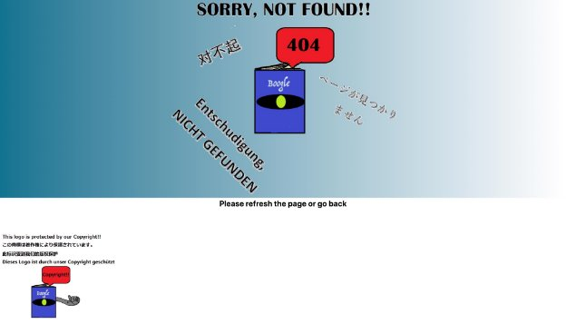

# Text Technologies for Data Science — Book Content Search Engine — BOOGLE
Ivan Sun; Yuanting Mao; Zhi Qi Lee; Yue Wang; Michitatsu Sato; Zhonghao Wen

## **Environment**
- React
- FastAPI
- MongoDB
- Python packages (pymongo, nltk, etc.)

## 1.**Introduction**

Our crew creates the search engine Boogle, which can be used to search books using a variety of keywords such as author, title and contents. Boogle uses a database of 12421637 documents scraped from the paragraphs of 9676 English fiction books, crawled from Project Gutenberg ([Gutenberg 2022). T](https://www.zotero.org/google-docs/?XSgYqN)he search engine can be accessed through the following URL link:

Website link: h[ttp://ttds-frontend-dot-axial-acrobat-338723.ew.r.appspot.com/](http://ttds-frontend-dot-axial-acrobat-338723.ew.r.appspot.com/)

The following chapter will discuss the inspiration and uniqueness of our search engine. Afterwards, we will demonstrate all of the strategies that we implement in the preceding four chapters: Data Crawling & Scraping; Frontend; Cloud Hosting Server and Backend. In the [Appendix, ](#_page10_x72.00_y72.00)we present you with a user story that you can use to navigate through all of our services.

## 2.**Motivation**

While several common PDF readers allow us to search certain contents within a book, they do not yet allow users to search specific contents across many ebooks or throughout an entire database. On the Gutenburg website, despite the fact that it seems to provide us with a full-text search, the service actually relies on *Yahoo!*, *Google* and *DuckDuckGo* to search for the text but uses neither its own search engine nor its database. Our search engine, Boogle, offers the service of searching the specific contents in all the books kept in our database and listing all the contents that match the search query. It will be incredibly beneficial to users who wish to search for specific material across multiple books, for example, when they wish to verify a saying and wish to identify its location with the least effort.

## 3.**Data Crawling and Scraping**

To prevent flooding the target website with requests, we opt not to request more than one piece of material at a time. To ensure that only one request is made at a time, we first run the crawler, which generates a list of the URLs to crawl, eliminating the need for a tree-like search throughout the crawling process. Additionally, we develop a crawler that saves the HTML source code when it receives a response from a website, enabling us to scrape the data offline. The contents are scraped mostly using the Python package BeautifulSoup4. We inspect the HTML's format and extract the information by recognising the HTMLattributes

and tags that are related to it. The difficult task at hand is extracting paragraphs from HTML-formatted book content. Owing to the fact that each book page encodes paragraphs differently, we must pay special attention to the common aspect of the pattern utilised to represent these paragraphs. We begin by extracting all possible paragraphs using HTML tags and then filtering these paragraphs using our self-defined filtering method, which eliminates some noise that is included as paragraphs (like chapter number, etc.). The extracted data is immediately saved as structured JSON-style objects in our database. Due to the fact that the crawling and scraping processes are completely automated, scheduled scraping is feasible. Once the timer expires, the server will execute scripts that check to see whether any modifications have been made to the target website. Scripts will scrape the new contents whenever a change is detected.

## 4.**Frontend**

We create a frontend website from the ground up. JavaScript is used as the programming language. We use Tailwind CSS, which is a utility-first CSS framework for fast-developing custom user interfaces. When the frontend was completed, it was uploaded to a Google server using the gcloud service so that people could access it using a web browser. Due to the page constraint, we will not discuss the Frontend structure in detail because it is not directly connected to the course; instead, we will focus on the other components of this project. However, we will provide you with a comprehensive user story in the Appe[ndix ](#_page10_x72.00_y72.00)section, which will detail all of the frontend functions we have. You are also invited to test it out on our website.

## 5.**Backend**
5.1.**Server Design**

As stated above, we decide to use a more modern approach to design the front end-user interface. Our backend server does not need to render the HTML and send it back as content for the display. Since the process of rendering and displaying can be done by the front end, the only job needed for the backend server is to return the appropriate data according to requests from the front end application. Since the task is straightforward, we avoid using whole web frameworks like Django. Instead, we use FastAPI, which provides an API-based server for front-end communication. We design the server to only accept the GET methods to the specific URL(domain) of the server as APIcalls since we need to protect our database from malicious attacks that use HTTP methods like POST, DELETE, and PUT. The API is carefully separated according to its function. For example, the system is designed to access the default search API which includes the function of query correction and query expansion. Once the user decides not to use these functions, the front-end application will call another API of the backend server. In this way, dividing functions into different APIs enables the code to be shorter and simpler, also easy to maintain and modify. Theoretically, the server is able to handle multiple requests from multiple frontend clients.

Figure 1. Diagram of Boogle Searching Engine

5.2.**Data Cleaning & Text Preprocessing**

Due to the fact that the data is retrieved directly from the HTML source code, several record fields are structured incorrectly and include useless data. We begin by cleaning the data using Python's built-in string techniques to eliminate all occurrences of escape characters such as "\n", "\r", and so on. Additionally, we extract the published date from the string "2008-06-27T00:00:00+00:00" and save it as a Python DateTime object. We then execute text-preprocessing on our data to prepare it for search engine indexing, such as tokenization, stop word removal, and stemming.

Our tokenizer function accepts a string as input and returns a list of tokens. Given the fact that our data collection is restricted to English fiction literature, numbers and symbols have little significance in our search. As a result, we choose the Python String maketrans( ) and translate( ) methods to convert all non-alphabetic characters in the input string to spaces. The string is case-folded into lower case. Then, using space as a separator, we split the string into a list of tokens and return the list. Due to the tokenizer's lack of special handling abilities for symbols such as hyphen mark - or prime symbol ', *Hewlett-Packard* and *Kiehl's* will be split into two separate tokens. This ought to provide no difficulty for information retrieval, as queries including these words (*Hewlett-Packard* and *Kiehl's*) will be tokenized by

the same tokenizer as well. If we set up special handling rules for particular symbols but the queries provided by users do not contain them, it may cause issues during the information retrieval stage unless we allocate additional memory to index both scenarios.

We delete stop words from the list of tokens using a premade English word list from the SMART (System for the Mechanical Analysis and Retrieval of Text) Information Retrieval System [(Salton and Lesk, 1965), w](https://www.zotero.org/google-docs/?PyNW8Z)hich was developed by Cornell University in the 1960s.

We utilise the PorterStemmer function from the NLTKPython library (Lop[er and Bird, 2002) ](https://www.zotero.org/google-docs/?JlrLVI)to reduce morphological variants of words to a single stem. For instance, this collection of tokens ['connection', 'connected', 'connects', 'connecting'] will be returned as ['connect', 'connect', 'connect', 'connect'].

5.3.**Database**

**MongoDB and PyMongo** MongoDB, a document-oriented database, is chosen as the database for this search engine because it combines extensive query and analytical capabilities with ease of installation. Additionally, there is a Python distribution that includes tools for interacting with it, which makes database modification relatively simple.

**Data structure** Data is already in the database at the time of collection. Each paragraph in a book is considered to be a document and for each document, the following information is stored:

|FIELD|EXPLANATION|DATA TYPE & EXAMPLE|
| - | - | - |
|***\_id***|The primary key for the stored document which is automatically generated when creating a new document in a collection.|ObjectID(“6219567a3a7328da6 d22459e”)|
|***book\_id***|The primary key for the book.|Integer 46|
|***image\_src***|The URL source for the book cover images.|String"https://www.gutenberg. org/cache/epub/46/pg46.cover .medium.jpg"|
|***title***|The title of the book.|String "\r \n AChristmas Carol in Prose; Being a Ghost Story of Christmas\n"|
|***author***|The author and years of birth and death.|String "Dickens, Charles, 1812-1870"|
|***author\_url***|The URL source for the author.|String "/ebooks/author/37"|
|***year***|Release date.|String "2004-08-11T00:00:00+00:00"|
|***language***|The language of the book.|String "en"|

|***subjects***|The subjects of the book.|String "Christmas stories, London (England) -- Fiction, Poor families ..."|
| - | - | - |
|***paragraph\_num***|Paragraph number.|Integer 2|
|***content***|A paragraph from the book.|String "December, 1843.\n "|
However, some of the original format is not that convenient for subsequent analysis and query, so they are updated. Details can be found in the following form.

|FIELD|MODIFICATION|
| - | - |
|***title*** and ***content***|Remove the codes like “\n” and “\r” which are meaningless.|
|***author***|
Separate into two sub-fields, name and the years of birth and death for the author. And if the information is not given or “unknown”, save it as an empty string.

EXAMPLE:  {'name': “Charles Dickens”,'year':”1812-1870”}.
|
|***year***|Use datetime objects in Python instead of the original string.|
|***tokens***|A new field which will be added after pre-processing. It saves a list of strings.|

5.4.**Inverted List and Field List**

After each document is preprocessed and stored in MongoDB, our model creates two indexes from token lists: an inverted index and an index for performing field searches.

First is the list of the inverted index and we store it in a nested dictionary with the format below,

{' ': {' ': [ ]}}

The first key is the token and the value is a dictionary. The second key is the document ID, and the value of it is a list of the position. Here the position is the position index after preprocessing. We include the position to enable proximity search and phrase search.

The second one is a field list and we store it in a nested dictionary with the format below,

{' ': {' ': [" ", " ℎ ", " "]}

Same as the inverted list, the first key is the token and the value is a dictionary. The second key is the document ID and the value is a list of strings to show this token occurs in which fields. If “content” occurs, it means this token occurs in the content field. One thing that needs to be mentioned is that the author field is not preprocessed and the title field is preprocessed as the content field.

These two lists are used for scoring the queries.

5.5.**Query processing**

Once the backend receives a query string, such as “Shelock holmse”, the query is autocorrected by a spelling checker to “Sherlock holmes” or expanded to appropriate author name depends on query. and it sends the query to the query parser. The parser transforms the query into two token lists: the first one is a preprocessed tokens using the same procedure as described in the preprocessing part of this document. The second is a list of  tokens without preprocessing to perform an exact field search.

5.6.**Building indexes on disk with SPIMI**

One problem with large datasets is that the produced inverted list and field list are also too large to be in memory. Therefore, we build the indexes using the SPIMImethod (Manni[ng, Raghavan and Schütze, 2009) w](https://www.zotero.org/google-docs/?yK3KSR)ith modification. The SPIMI method makes a single pass of the document and produces dynamic posting lists that could grow in size. It then sorts and stores the posting lists to disk when the memory is full. After the single pass, SPIMImerges the files generated on disk to a single inverted index by reading each of the files line by line, so the processing could fit in the memory of a single computer. We modified SPIMIso that when the memory is full, the algorithm writes to MongoDB and merges the posting lists directly if the posting list is already in MongoDB.

5.7.**Loading indexes back to memory**

Indexing this large also cannot fit into the memory of a single instance. Therefore, we implement an index queue that loads only part of the indexes. When new queries come in and the memory reaches a threshold, the system pops the oldest node. The index queue can also be easily modified to use other cache replacement policies such as LRU.

5.8.**Document retrieval and Ranking**

After the query is processed, first the list of tokens goes through the field index to check if the token is in our whole token dictionaries. If all tokens in the query are not found, just return search not find. If any token exists, start the scoring depending on their field.

**Document retrieval**

For content, supporting two search methods on preprocessed query with inverted index list.

TFIDF: first get the set of all documents containing any token in the query, then for each document, calculate the TFIDF score and sort them by scores. Phrase/Proximity search: the system intersects each token’s postings list and measures the distance of consecutive tokens’ positions. A tolerance of 2 is set, meaning tokens should appear no further than 2 words apart.

Supporting field search on a preprocessed query with a field index list is available for the title. Additionally, for writers, a field index list is provided to aid in searching on a query that has not been preprocessed.

Field Search: For each token in the query, check if the token occurs in that field, get the document and assign a fixed score to it. Finally, sum up the scores for each document and sort by scores. Lastly, check the document’s book\_id, which is used to indicate the document belongs to which book and delete repeated ones. This is to avoid returning the same books.

**Ranking**

The system collects all results returned by phrase search and is given a fixed score because it will be an exact match, top 20 results from TFIDF, 5 results from title field search and 5 results from author field search. Then the system would sum up the same documents’ scores and remove repeated documents and sort by sum up scores.

## **Group members’ contribution**

Everyone is quite active and engaged throughout the duration of the project. We held the weekly meeting, and no one was absent from any meeting. Generally, each team member was assigned the same amount of work. All tasks have been completed to this point, and the search engine should function normally. If you come across any difficulties getting connected to the website or have any confusion on the functionalities, please send an email to [J.Sun-27@sms.ed.ac.uk (](mailto:J.Sun-27@sms.ed.ac.uk)Ivan) or [M.Sato-4@sms.ed.ac.uk (](mailto:M.Sato-4@sms.ed.ac.uk)Michitatsu).

Ivan Sun (Frotend Expert)

Attended the weekly meeting on time. Contributed to the development and refinement of the frontend, which was then deployed to the server for the users to get connected online. Tried to catch errors and then directed the page to the 404 Not Found page. Wrote the report and formatted the writing throughout the entire document. Finished drafting and refining the User Story. *Michitatsu Sato* and I collaborated on the design of the project's logo.

Michitatsu Sato (Data scraping and Server Expert)

Attended the weekly meeting on time. Mainly contributed to data scraping and server-frontend communications. Implemented and ran the crawler, scraper and scripts for auto scraping. In addition, he built the server using the FastAPI framework with *Yuanting Mao* and deployed it to the cloud server. As part of the server implementation jobs, managed the pipeline for each searching process. Adjusted and defined data type for communication between each component with other team members.

Zhi Qi Lee (Preprocessing and Database Expert)

Attended the weekly meeting on time. Mainly contributed to data cleaning, text preprocessing and stuff related to databases such as the setup of the database, maintenance of database, query to database and output from the database. Aided other members on communication with the database. Identified incomplete and irrelevant parts of the data, then modified the coarse data. Implemented tokenizer, stopword removal and porter stemmer for text preprocessing. Collaborated with *Yue Wang* on the design of database schema. Designed algorithms that are used for output to the frontend that satisfies certain conditions.

Yue Wang (Database Expert)

Attended the weekly meeting on time. Designed the structure of the data to be stored in the database and modified the collected data to the designed format with *Zhi Qi Lee*. Mainly responsible for the collation of author-related data and the implementation of recommended search based on author's first name and title. Wrote the report and formatted the writing throughout the entire document.

Zhonghao Wen (Backend Expert)

Attended the weekly meeting on time. Mainly contributed to generating two lists, inverted index and field index, connecting databases, designing the query processing, scoring methods and ranking system, and finally deployed to the cloud. With Yuanting Mao, dealing with large memory usage problems by SPIMI, merging backend codes and debugging backend.

Yuanting Mao (Fullstack)

Attended the weekly meeting on time. Collaborated with *Michitatsu Sato* and *Ivan Sun* on components implementation and debugging on the frontend. With *Michitatsu Sato* on the backend on migration to FastAPIand debugging communication issues. With *Zhonghao Wen* on integration with various searching algorithms, SPIMI indexing and implementation of index queue. With *Zhi Qi Lee* and *Yue Wang* on communication between the backend and the database. In addition, he set up the server online with the rest of the team and made sure the data flow correctly by debugging various problems such as memory overflow and exceptions on both frontend and backend during the development of the project.

## **Reference**

[Loper, E. and Bird, S. (2002). NLTK: The Natural Language Toolkit. *arXiv:cs/0205028*. \[Online\]. Available at: http://arxiv.org/abs/cs/0205028 \[Accessed 14 March 2022\].](https://www.zotero.org/google-docs/?m1KoIy)

[Manning, C. D., Raghavan, P. and Schütze, H. (2009). *Introduction to Information Retrieval*. P.569.](https://www.zotero.org/google-docs/?m1KoIy)

[Salton, G. and Lesk, M. E. (1965). The SMART automatic document retrieval systems - an illustration. *Communications of the ACM*, 8 (6), pp.391–398. \[Online\]. Available at: doi:10.1145/364955.364990.](https://www.zotero.org/google-docs/?m1KoIy)

[*Project Gutenberg*. \[Online\]. Available at: https://www.gutenberg.org/ \[Accessed 11 March 2022\].](https://www.zotero.org/google-docs/?m1KoIy)

## **Appendix A: User Story**

To demonstrate the capabilities of Boogle, we have prepared a complete user story for you to follow. We listed all probable user statuses, beginning with the initial connection to the website and ending with the user's choosing to exit the website.

1.A user types the URL into their browser and connects to our website. Our website's home page looks as follows:

2.The user types the desired content they want to search in the Search bar. Then they either click the Search button on the right of the search bar or press Enter key to search. In the user story, we use “Conan Doyle”.

3.The webpage will reload and send back the items that match. In “Conan Doyle” 

scenario, the first result is a sentence from a book that contains the phrase “Conan Doyle”. Then in the following, search engine shows some book results that were written by  Conan Doyle.

4.If the user comes across some network problems, the search engine will load the 404 Not Found Page. 

5.User can click the title of the book and the it will jump to the html page that belongs to Gutenberg.

6.The website could detect some spelling problems and indicate whether the users intended to misspell the words or whether they simply mistyped them. For example, the user might type "You know my metods, Watson." Clearly, the word metods is misspelt in this instance. The search engine will show “Searching results for You know my \*methods\*, Watson”. The words that have been highlighted with \* marks represent those that have been identified as misspelt by the search engine.

7.If the user still wants to search for the quote they want, then they can click the quote “Search instead for You know my metods, Watson” shown on the website. If the search engine is unable to locate any relevant results, it will display "No Match!" on the web page concerned.

8.When a person has finished searching, they can just exit the page without further action.

**A small bonus service**

We added a functionality to the search page that displays a random author name and will change it daily. If you click on the author's name, the author's name will display in the search field. The search engine will direct you to the author's wikipedia entry if you click on the "wikipedia". If you click the "I'm feeling lucky" button, the search engine will reload a name.  The assumption is that this author maintains a wiki page.

